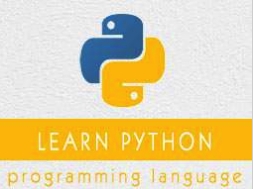

```
Roberto Nogueira  
BSd EE, MSd CE
Solution Integrator Experienced - Certified by Ericsson
```
# Tutorialspoint Python Tutorial



**About This Tutorial**

This is to grasp rapidly the language and its concepts.

[Python Tutorial](https://www.tutorialspoint.com//python/index.htm)

#### Topics
```
Python Basic Tutorial
[ ] Home
[ ] Overview
[ ] Environment Setup
[ ] Basic Syntax
[ ] Variable Types
[ ] Basic Operators
[ ] Decision Making
[ ] Loops
[ ] Numbers
[ ] Strings
[ ] Lists
[ ] Tuples
[ ] Dictionary
[ ] Date & Time
[ ] Functions
[ ] Modules
[ ] Files I/O
[ ] Exceptions
Python Advanced Tutorial
[ ] Classes/Objects
[ ] Reg Expressions
[ ] CGI Programming
[ ] Database Access
[ ] Networking
[ ] Sending Email
[ ] Multithreading
[ ] XML Processing
[ ] GUI Programming
[ ] Further Extensions
Python Useful Resources
[ ] Questions and Answers
[ ] Quick Guide
[ ] Tools/Utilities
[ ] Useful Resources
[ ] Discussion
Selected Reading
[ ] Developer's Best Practices
[ ] Questions and Answers
[ ] Effective Resume Writing
[ ] HR Interview Questions
[ ] Computer Glossary
[ ] Who is Who
```

